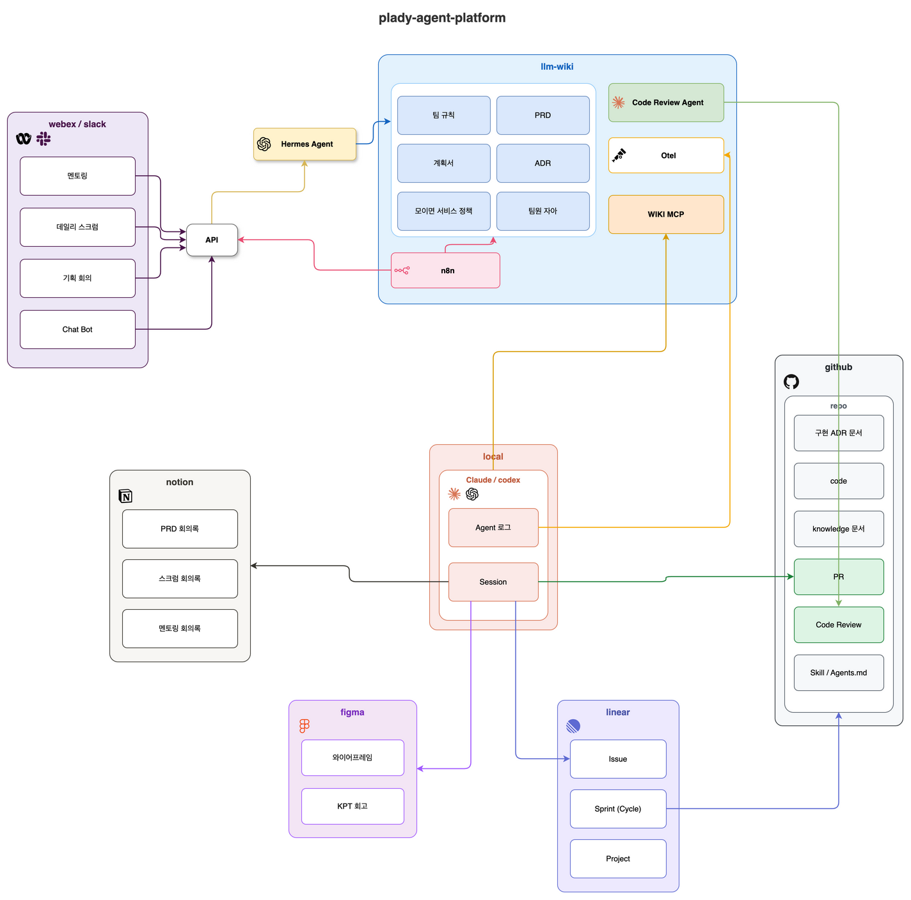

# plady-agent-platform

`plady-agent-platform`은 Plady 에이전트 서비스를 위한 플랫폼 기반 저장소입니다. 현재는 업스트림 `llm-wiki` MCP 서버와 Hugo 위키 UI를 감싸는 형태로 구성되어 있으며, 앞으로 `agent.plady.io`에서 구현될 플랫폼 작업의 계약을 정의합니다.

업스트림 코드 미러:

- `llm-wiki/`: https://github.com/geronimo-iia/llm-wiki
- `llm-wiki-hugo-cms/`: https://github.com/geronimo-iia/llm-wiki-hugo-cms

## 개발 환경 아키텍처



원본 다이어그램은 [`dev-environment-architecture.drawio`](dev-environment-architecture.drawio)이며, draw.io에서 열어 수정할 수 있습니다(PNG에도 다이어그램 XML이 포함되어 있어 draw.io에서 바로 열 수 있습니다).

## 플랫폼 계약

PLA-246은 `docs/` 아래에 초기 플랫폼 계약을 정의합니다.

- [`docs/platform-contract.md`](docs/platform-contract.md): 루트 `plady.io`와 위임된 `agent.plady.io`의 소유권, 공개 엔드포인트 계약, Route 53 접근 메모, SSM 파라미터 이름 계약.
- [`docs/pla-244-handoff.md`](docs/pla-244-handoff.md): PLA-244 Slack ↔ Hermes 통합 작업을 위한 핸드오프 계약.
- [`docs/hermes-gateway.md`](docs/hermes-gateway.md): Hermes Gateway 런타임 런북(PLA-249) — 시작/중지/재시작/헬스 체크, 세션 영속성/초기화/롤백, 보안 메모, OpenAI 호환 클라이언트 계약.
- [`docs/mcp-registry.md`](docs/mcp-registry.md): MCP 레지스트리와 안전한 도구 정책 계약(PLA-250) — 서버 레지스트리, 허용/승인/거부 도구 등급, 쓰기 승인 흐름, 등록/스모크 런북. 기계가 읽을 수 있는 형식은 [`config/mcp-registry.yaml`](config/mcp-registry.yaml)입니다.
- [`docs/otel-collector.md`](docs/otel-collector.md): 내부 전용 OpenTelemetry Collector 런북(PLA-251) — 내부 OTLP 대상, 파일/로컬 우선 export, 개인정보 보호/정제 계약(원본 프롬프트/완성, 시크릿/토큰, PII 금지).
- [`docs/n8n-placeholder.md`](docs/n8n-placeholder.md): `n8n.agent.plady.io` 예약/비활성 플레이스홀더 계약(PLA-251)과 향후 활성화 체크리스트.

현재 엔드포인트 요약(SSOT는 [`docs/platform-contract.md`](docs/platform-contract.md)):

| 엔드포인트 | 목적 |
| --- | --- |
| `public 비공개` | 위키 UI |
| `https://mcp.agent.plady.io/mcp` | bearer token으로 보호되는 llm-wiki MCP HTTP 엔드포인트 |
| `https://hermes.agent.plady.io` | Hermes Gateway 공개 origin |
| `https://hermes.agent.plady.io/v1` | OpenAI 호환 Hermes base URL |
| `https://n8n.agent.plady.io` | 예약/비활성 플레이스홀더([`docs/n8n-placeholder.md`](docs/n8n-placeholder.md)) |
| OTEL collector | 내부 전용; 공개 엔드포인트 없음([`docs/otel-collector.md`](docs/otel-collector.md)) |

시크릿 값은 절대 커밋하거나 Linear/GitHub/문서에 붙여 넣으면 안 됩니다. 이 저장소 계약에 포함되는 것은 [`docs/platform-contract.md`](docs/platform-contract.md)에 문서화된 파라미터 이름뿐입니다.

## 에이전트 스킬

승인된 에이전트 스킬의 SSOT는 `.agents/skills/<name>/` 아래에 있습니다. Claude 호환 스킬 디스커버리는 `.claude/skills/<name>` 아래의 상대 심볼릭 링크를 사용합니다.

```text
.agents/skills/linear-issue-session/
.agents/skills/linear-parallel-planner/
.claude/skills/linear-issue-session -> ../../.agents/skills/linear-issue-session
.claude/skills/linear-parallel-planner -> ../../.agents/skills/linear-parallel-planner
```

중단된 worktree에서 승인되지 않은 스킬/플러그인 확장물을 이 저장소로 복사하지 마세요.

## Docker Compose 로컬 실행

```bash
export MCP_BEARER_TOKEN="dev-only-change-me"
docker compose up -d --build
```

서비스:

| 서비스 | URL | 목적 |
| --- | --- | --- |
| `mcp-proxy` | `http://localhost:18765/mcp` | 로컬 bearer token 보호 llm-wiki MCP HTTP 엔드포인트 |
| `wiki-ui` | `http://localhost:1313` | 로컬 Hugo 위키 UI |
| `hermes-gateway` | `http://localhost:8642/v1` | Hermes Agent OpenAI 호환 게이트웨이(`hermes` 프로필; [`docs/hermes-gateway.md`](docs/hermes-gateway.md) 참고) |

`hermes-gateway` 서비스는 `hermes` compose 프로필 뒤에 있으며 `HERMES_API_SERVER_KEY`(`/plady/agent-platform/<env>/hermes-api-server-key`의 값)가 필요합니다. 기본 `docker compose up`으로는 시작되지 않습니다.

```bash
export HERMES_API_SERVER_KEY="dev-only-change-me"
docker compose --profile hermes up -d hermes-gateway
scripts/hermes-gateway-smoke.sh   # health + auth boundary + /v1/models
```

`otel-collector` 서비스도 프로필(`otel`)로 보호되며 **내부 전용**입니다. compose 네트워크의 `otel-collector:4317`(gRPC) / `otel-collector:4318`(HTTP)에서 OTLP를 수신하고, 호스트 publish나 공개 엔드포인트가 없으며, 원본 프롬프트/완성, 시크릿/토큰, PII를 제거한 뒤 파일/로컬 우선으로 export합니다([`docs/otel-collector.md`](docs/otel-collector.md) 참고).

```bash
# 시작하지 않고 설정 검증
docker run --rm -v "$PWD/otel/collector-config.yaml":/etc/otelcol-contrib/config.yaml:ro \
  otel/opentelemetry-collector-contrib:0.154.0 validate --config /etc/otelcol-contrib/config.yaml

docker compose --profile otel up -d otel-collector
```

`n8n.agent.plady.io`는 예약된 비활성 플레이스홀더일 뿐입니다(공개 ALB는 503을 반환하며, compose의 `n8n` 블록은 주석 처리되어 시작할 수 없습니다). 자세한 내용은 [`docs/n8n-placeholder.md`](docs/n8n-placeholder.md)를 참고하세요.

첫 실행 시 `llm-wiki` 컨테이너는 로컬 `./wiki-workspace`에 `100thieves` 위키 공간을 초기화하고, `wiki-ui`는 선별된 페이지(`/people`, `/topics`, `/sources`)와 원본 소스 아카이브(`/raw`)를 포함해 같은 위키 콘텐츠를 렌더링합니다. `./wiki-workspace`는 llm-wiki가 초기화하는 별도 git 저장소이며, 이 래퍼 저장소에서는 무시됩니다.

MCP 요청이 `mcp-proxy`를 통과하려면 `Authorization: Bearer $MCP_BEARER_TOKEN` 헤더를 포함해야 합니다.

서비스 중지:

```bash
docker compose down
```

Compose 볼륨 초기화:

```bash
docker compose down -v
```

로컬 위키 데이터까지 삭제하려면 컨테이너를 중지한 뒤 `wiki-workspace/`를 삭제하세요.

## 위키 데이터 저장소

MCP ingest 출력(회의록, ADR, 멘토링 노트, 기타 지속 보관할 위키 지식)은 이 래퍼 저장소가 아니라 [`100Thieves-team/team-wiki-v2`](https://github.com/100Thieves-team/team-wiki-v2)에 저장됩니다. 자세한 내용은 [`docs/wiki-data-repo.md`](docs/wiki-data-repo.md)를 참고하세요.

## 배포 상태

기존 EC2/Caddy 배포 문서는 과거 위키 배포 맥락을 위해 남아 있지만, 새로운 `agent.plady.io` 플랫폼 계약은 **아닙니다**. 새로운 DNS/ACM/ALB/Terraform 구현은 PLA-247에 속하며 [`docs/platform-contract.md`](docs/platform-contract.md)를 따라야 합니다.

레거시 참고 자료:

- [`docs/ec2-deployment-setup.md`](docs/ec2-deployment-setup.md)
- [`infra/terraform/ec2/README.md`](infra/terraform/ec2/README.md)

## 에이전트 ingest 워크플로

`wiki_ingest`는 검증/인덱싱/git commit 단계이며, AI 컴파일 단계 자체가 아닙니다. MCP 클라이언트 에이전트가 원본 문서를 지속 보관 가능한 위키 지식으로 변환할 책임이 있습니다. 자세한 내용은 [`docs/agent-ingest-workflow.md`](docs/agent-ingest-workflow.md)를 참고하세요.
